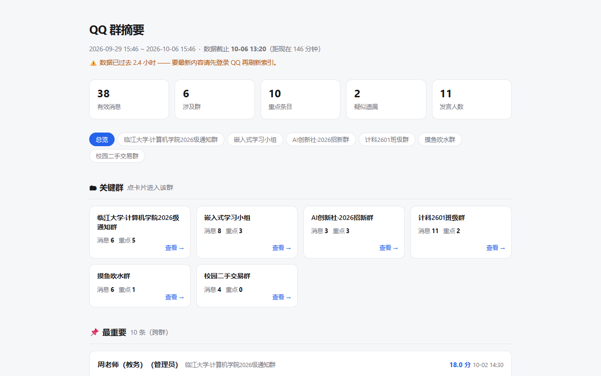
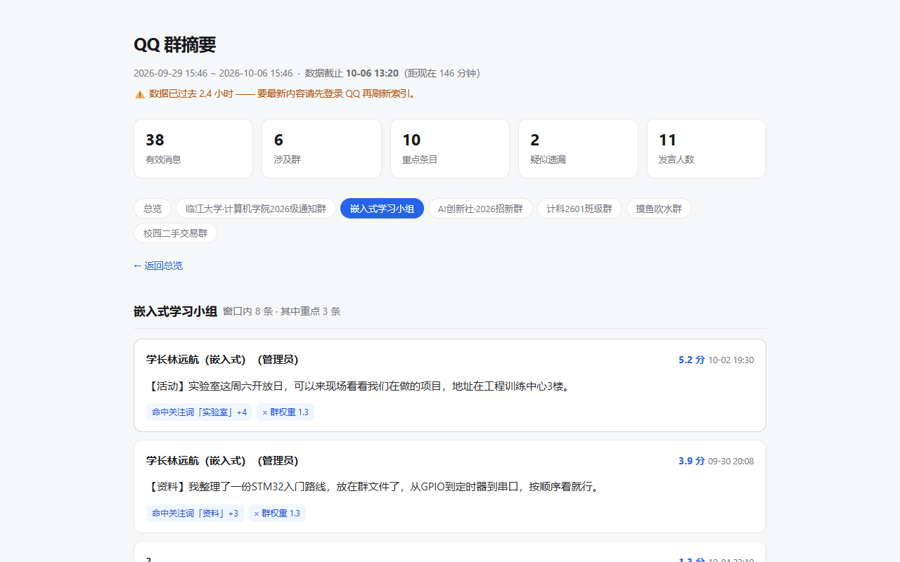

# QQreminder

> **群太多，重要的那条总是被淹掉。**
>
> 一天没看手机，四百条未读里就是三条跟你有关：一条选课通知、一条提交截止、一条你被 @ 了。
> 剩下的全是"哈哈哈哈"和表情包。
>
> QQreminder 就是干这个的：**把"我该知道的"从"我错过的"里挑出来。**

给 [DeepSeek Harness](https://github.com/deepseek-ai/deepseek-harness) 用的插件。
**全程本地、只读、不登录、不联网上传。**

---

## 它长什么样

**一份能点进去的报告**（下面两张都是真截图，数据是插件自带的虚构示例）：



- 顶部五个数字：**有效消息 / 涉及群 / 重点条目 / 疑似遗漏 / 发言人数**
- **🗂 关键群卡片** —— 点一张就进那个群
- **📌 最重要 N 条** —— 每条都写着「**为什么重要**」（命中了哪个关注词、是谁发的、权重多少）
- **⚠️ 你可能漏了** —— 分数不高、但带时效/行动词的消息（最容易被淹掉的那类）

**点进某个群，只看这个群**：



顶部页签、群卡片、消息分布条 —— **三个入口都能进群**，怎么顺手怎么点。

> 💡 截图顶部那行橙色提示「数据已过去 2.4 小时」不是 bug，是**故意**的：
> 它读的是本地数据库文件的最后写入时间。QQ 没开、没登录过，它就冻在那儿 ——
> **插件会如实告诉你数据有多新，绝不拿旧数据当实时。**

---

## 装上之后怎么用

### 三步上手

```
① 装插件（下面有安装命令）
② 打开 DSH → 设置 → QQreminder
③ 第一次没有数据？点【📦 加载示例数据】
   → 立刻生成一份虚构的大学群聊，看看它到底能干嘛
```

**示例数据是虚构的**（临江大学 / 刘老师 / 周老师……），人名群名对话全是编的，随便看随便截图。

### 然后，直接跟 AI 说人话就行

这个插件**自带技能和工具**，所以 AI 装上就知道它能干什么：

> 「**翻一下群，看看今天有什么重要的**」
>
> 「**帮我找群里关于选课的所有信息**」
>
> 「**有没有我漏掉的？**」

AI 会自己调 `qq_search` / `qq_digest`，**不需要你记任何命令**。

面板上还有两个按钮：

| 按钮 | 做什么 |
|---|---|
| **📄 生成报告** | 选个日期区间 → 出一份上面的 HTML 报告 |
| **📝 生成摘要** | 把一句指令**自动复制到剪贴板** → 粘给 AI |
| **✨ 用 AI 分析** | 第一次用时帮你**分析该盯哪些群、该关注什么词** |

> ⚠️ 面板上写清楚了**哪个按钮会改配置**：只有「应用选中」才会写。
> 其他按钮都只是**准备材料**，不会偷偷动你的东西。

---

## 安装

```bash
# 从 GitHub 装（需要 DSH 0.2.0+）
dsh plugin add https://github.com/K9m1a5c/dsh-qqreminder
```

或者本地打包：

```bash
git clone https://github.com/K9m1a5c/dsh-qqreminder
cd dsh-qqreminder
npm pack
dsh plugin add dsh-qqreminder-*.tgz
```

**依赖**：只要 Python 3.8+（引擎**全部用标准库**，不需要 pip install 任何东西）。
插件会自动找 `python3` / `python` / `py`，找不到会在面板里告诉你。

---

## 数据从哪来？（重要，请先读这段）

QQreminder 是**分析层**，它需要一个**已经建好的本地索引**才能工作。

### 方式 A：先用示例数据（推荐第一次）

点面板上的【📦 加载示例数据】，它会生成一份**虚构数据**放进你的数据目录。
**零配置、零风险**，用来试试功能、看看报告长什么样。

### 方式 B：接入你自己的聊天记录

**本仓库不包含解密模块**，也不提供任何绕过 QQ 加密的代码。
你需要自己准备好数据，然后在数据目录下建一份 SQLite 索引：

```
<数据目录>/                          # 默认 ~/QQreminder，可用环境变量 QQREMINDER_ROOT 改
└── qgd/
    ├── data/index.db                # 索引（表结构见下）
    ├── focus.json                   # 你的配置：监工群 / 关注词 / 打分规则
    └── authorization.json           # 授权开关：{"qq_read": true}
```

`index.db` 需要的三张表：

```sql
-- 消息（核心）
messages(msg_id INTEGER PRIMARY KEY, ts INTEGER, day TEXT, hour INTEGER,
         group_code TEXT, group_name TEXT, sender_uid TEXT, sender_qq TEXT,
         sender_name TEXT, direction TEXT, msg_type INTEGER, subtype INTEGER,
         kind TEXT, text TEXT, reply_seq INTEGER)

-- 群
groups(group_code TEXT PRIMARY KEY, group_name TEXT, weight REAL,
       msg_count INTEGER, last_ts INTEGER)

-- 元信息（至少要 cutoff_ts，报告会如实声明数据截止时间）
meta(key TEXT PRIMARY KEY, value TEXT)   -- cutoff_ts / built_at / read_errors ...
```

`engine/load_example.py` 就是照着这个结构写数据的，**可以直接当参考实现看**。

### 配置：`focus.json`

```jsonc
{
  "监工群": [ { "群号": "…", "群名": "…", "权重": 2.0 } ],
  "关注词": { "截止": 6, "报名": 5, "选课": 6 },     // 命中即加权
  "降权词": { "抽奖": -3, "优惠": -3 },
  "身份词": ["老师", "班助", "学长"],                // 名片里带这些 = 可信来源
  "通知词": { "强": ["通知", "全体成员", "务必"], "弱": ["提醒", "安排"] },
  "遗漏提示词": { "时效": ["截止", "之前"], "行动": ["报名", "提交"] },
  "打分": { "遗漏区间": [2, 6], "过期天数": 2 }
}
```

**「关注词」是你可以随便改的地方** —— 学生写"选课/保研"，上班族写"需求变更/报销/周会"，
**改成你自己的词，它就开始替你干活。**

---

## 它凭什么挑得准？

打分是**多信号加权**，不是数关键词：

| 信号 | 分值 | 为什么 |
|---|---|---|
| 命中关注词 | **+6** | 你最在意的，优先 |
| **@我** | **+5** | 点你名了，基本跑不掉 |
| 群主 / 管理员发的 | **+4** | 权威来源 |
| 名片含身份词（老师/班助/学长） | **+3** | 同上 |
| 通知类强词 / 弱词 | +3 / +1 | 「务必」「全体成员」vs「提醒」 |
| 长文 | +1 ~ +2 | 通知往往写得长 |
| 转发 | +1 | 常是"帮转一下"的重要事 |
| **× 群权重** | ×0.4 ~ ×2.0 | 摸鱼群的事再热闹也不该顶掉班群 |

外加一层**「你可能漏了」**：分数中等（2~6）但含**时效 / 行动 / 疑问**词的消息 ——
这类最容易被"群消息太多"淹没，超过 2 天还会标**已过期**。

### 一个设计上的取舍

本地规则永远追不上行业差异 ——
学生关心「选课」，上班族关心「报销」，本地词表写不完。

所以这里分两层：

```
本地脚本 = 召回（快、免费、离线可用，负责把可疑的都捞出来）
AI       = 精排（真正理解内容，适应任何行业）
```

面板上的【✨ 用 AI 分析】就是这个思路：**本地只做客观统计和抽样**，
把材料交给 AI，由它判断"哪些群值得盯、该关注什么词"。

---

## 诚实边界（这些它做不到）

- ⚠️ **看不到 QQ 没同步下来的消息**。它读的是**本地数据库文件**，不是连着 QQ。
  QQ 关着 → 文件冻在最后关闭那一刻；很久没登录 → 中间那几天**根本没有**。
- ⚠️ **不会自动知道"还有新消息"**。它只报告文件里有什么，以及**数据截止到几点**。
- ⚠️ **不登录、不碰协议端、不连腾讯服务器**。只有你本机的文件读取。
- ⚠️ **只读**。一个字节都不会改你的 QQ 数据目录。
- ⚠️ **Windows 优先**（开发和测试都在 Windows）。核心逻辑是跨平台的，
  但"用系统浏览器打开报告"这类便利功能目前是 Windows 实现。

**隐私**：所有分析都在本机完成。唯一会"出去"的，是你在对话里主动交给 AI 的内容
（比如点【用 AI 分析】后把材料发出去）—— 这一步**由你决定**。

---

## 授权开关

面板上有一个 **「QQ 内容读取」** 开关，对应 `authorization.json` 里的 `qq_read`：

- **打开**：可以读群消息正文，生成摘要和报告
- **关闭**：**只能输出统计和元数据**（群名、消息量、时间跨度），
  后端接口直接返回 403，任何正文都不会出现在输出里

**这是给你（而不是给程序）的控制权**：随时可撤销。

---

## 项目结构

```
dsh-qqreminder/
├── lib/
│   ├── index.js              # 宿主侧：12 个 HTTP 端点 + 自带技能 + 2 个 AI 工具
│   └── client.js             # 面板：设置页里的「QQreminder」
├── assets/qqreminder.md      # 自带技能（AI 的操作手册）
├── engine/                   # ★ 分析引擎（纯 Python 标准库）
│   ├── score.py              # 多信号打分 → 摘要 + 遗漏提醒
│   ├── make_report.py        # 可点击的 HTML 报告
│   ├── search_topic.py       # 话题检索（带上下文）
│   ├── pack_material.py      # 给 AI 备料（客观统计 + 抽样）
│   ├── autoconfig.py         # 冷启动分析（纯本地版）
│   ├── load_example.py       # 生成示例数据
│   └── demo-student.json     # 虚构示例数据
└── docs/                     # 截图
```

**引擎随插件走**（在 `engine/` 里），**数据在你自己的目录**里 ——
两者彻底分开，所以你可以随时把数据目录指向别处，甚至放多份不同数据。

---

## 环境变量

| 变量 | 作用 | 默认 |
|---|---|---|
| `QQREMINDER_ROOT` | 数据根目录 | `~/QQreminder` |

---

## License

MIT

## 一点说明

示例数据里的人物、学校、群聊内容**全部是虚构的**，与任何真实个人或组织无关。
截图用的就是这份示例数据。

如果你要分享自己的报告截图，**记得先看一眼里面有没有别人的真名** ——
群里说话的是活人，他们的名字不该因为你分享工具而出现在互联网上。
